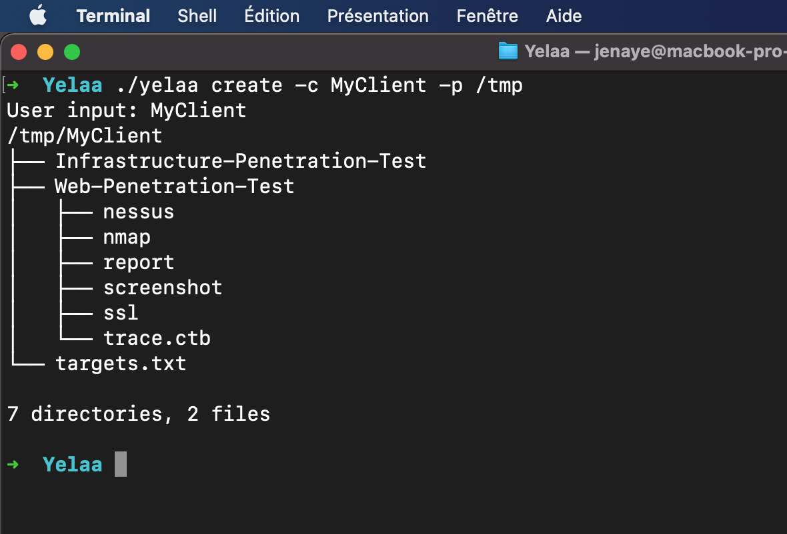
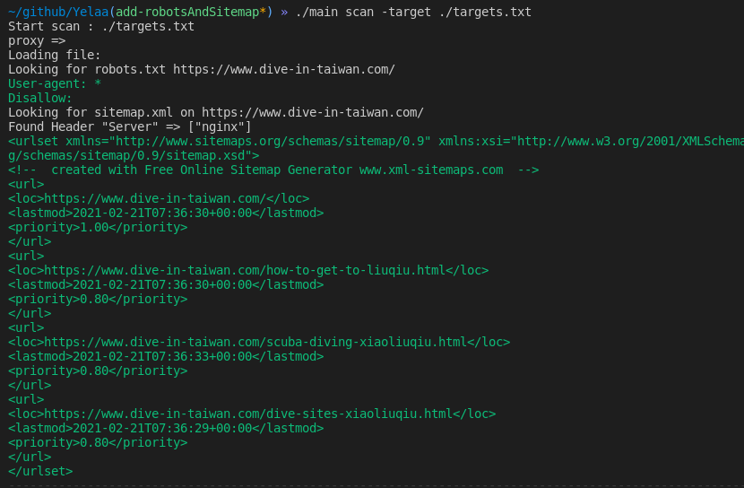

# Yelaa

Obtain a clean-cut architecture at the launch of a mission and make some tests

# Requirements

Go theses binary in your path : 
```
nuclei, dirsearch, testssl, subfinder, dnsx, httpx
```
> To install nuclei, subfinder, dnsx and httpx run `./install.sh`

> You can set alias like this `dirsearch='python /home/jenaye/softs/dirsearch/dirsearch.py'` 

## How to use 
>-s is optionnal
You can run `yelaa create -c <client> -s <PathToSharedFolder>`

## How to run scan 

`yelaa scan -target <PathToTargetFile>`

## Use http proxy

`yelaa scan -p http://localhost:8080 -target ./targets.txt`

>Flag `-k` is available to skip tls configuration

## How to run osint on a domain

`yelaa osint -d example.com`

To run osint command on several domains run `yelaa osint -t domains.txt`

## Help 

``` 
./yelaa -h 
 __   __         _
 \ \ / /   ___  | |
  \ V /   / _ \ | |  / _` |  / _` |
   | |   |  __/ | | | (_| | | (_| |
   |_|    \___| |_|  \__,_|  \__,_|
Obtain a clean-cut architecture at the launch of a mission and make some tests

Usage:
  create -c [client name] [flags]
  create [command]

Available Commands:
  help        Help about any command
  osint       Run subfinder, dnsx and httpx to find ips and subdomains of a specific domain
  scan        It will run Nuclei templates, sslscan, dirsearch and more.

Flags:
  -c, --client string         Client name
  -e, --excludedType string   excluded type
  -h, --help                  help for create
  -k, --insecure              Allow insecure certificate
  -p, --proxy string          Add HTTP proxy
  -s, --shared string         path to shared folder

Use "create [command] --help" for more information about a command.

``` 

>this script will create a default structure, as well as a cherytree database with payloads for external testing and useful commands for internal testing.

# Preview command create



# Preview command scan 



# Contributors

[darkweak](https://github.com/darkweak)
[jenaye](https://github.com/jenaye)
[jarrault](https://github.com/jarrault)
